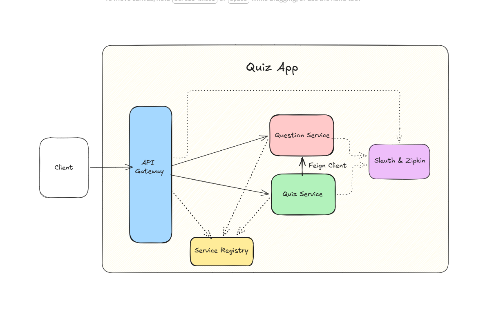

# Quiz Application — Microservices Architecture

A distributed quiz application built with Spring Boot microservices, featuring service discovery, API gateway routing, and distributed tracing.

---

## Architecture



---

## Services

| Service | Port | Description |
|---|---|---|
| `service-registry` | 8761 | Eureka service discovery |
| `api-gateway` | 8083 | Spring Cloud Gateway — routes all incoming requests |
| `quiz-service` | 8081 | Manages quizzes, calls question-service via Feign |
| `question-service` | 9082 | Manages questions, receives calls from quiz-service |
| Zipkin | 9411 | Distributed tracing UI |

---

## Tech Stack

- **Java 21**
- **Spring Boot 3.3.0**
- **Spring Cloud 2023.0.1**
- **Spring Cloud Gateway** — API Gateway
- **Spring Cloud Netflix Eureka** — Service Registry
- **OpenFeign** — Inter-service communication
- **Micrometer + Brave** — Distributed tracing
- **Zipkin** — Trace visualization
- **Spring Data JPA + Hibernate** — ORM
- **MySQL** — Database
- **Lombok** — Boilerplate reduction

---

## Prerequisites

- Java 21+
- Maven 3.8+
- MySQL running on port 3306
- Zipkin JAR downloaded

---

## Database Setup

Create the database in MySQL:

```sql
CREATE DATABASE microservice;
```

Tables are auto-created by Hibernate on startup via:

```properties
spring.jpa.hibernate.ddl-auto=update
```

---

## Running the Application

### Step 1: Start Zipkin

```bash
java -jar zipkin-server-*-exec.jar
```

Zipkin UI available at: `http://localhost:9411`

### Step 2: Start Services (in order)

```bash
# 1. Service Registry — must start first
cd service-registry && mvn spring-boot:run

# 2. Question Service
cd question-service && mvn spring-boot:run

# 3. Quiz Service
cd quiz-service && mvn spring-boot:run

# 4. API Gateway — start last
cd api-gateway && mvn spring-boot:run
```

---

## API Endpoints

All requests go through the API Gateway on port `8083`.

### Quiz Service

| Method | Endpoint | Description |
|---|---|---|
| `POST` | `/quiz` | Create a new quiz |
| `GET` | `/quiz` | Get all quizzes with questions |
| `GET` | `/quiz/{id}` | Get a quiz by ID with questions |

### Question Service

| Method | Endpoint | Description |
|---|---|---|
| `POST` | `/question` | Add a new question |
| `GET` | `/question` | Get all questions |
| `GET` | `/question/{id}` | Get a question by ID |
| `GET` | `/question/quiz/{quizId}` | Get all questions for a quiz |

### Example Requests

**Create a quiz:**
```bash
curl -X POST http://localhost:8083/quiz \
  -H "Content-Type: application/json" \
  -d '{"title": "Java Basics"}'
```

**Get quiz with questions:**
```bash
curl http://localhost:8083/quiz/1
```

**Add a question:**
```bash
curl -X POST http://localhost:8083/question \
  -H "Content-Type: application/json" \
  -d '{"question": "What is JVM?", "quizId": 1}'
```

---

## Distributed Tracing

This application uses **Micrometer + Brave + Zipkin** for distributed tracing across all services.

### How it works

When a request hits the API Gateway, a `traceId` is generated and propagated automatically through every downstream service call via HTTP headers. Each service creates its own `spanId` while sharing the same `traceId`.

```
api-gateway     [traceId: abc123, spanId: abc123]
  └─ quiz-service    [traceId: abc123, spanId: def456]
       └─ question-service [traceId: abc123, spanId: ghi789]
```

### Viewing traces

1. Make any request through the gateway
2. Open `http://localhost:9411`
3. Click **Run Query** to see the full distributed trace

### Log output

```
18:33:11 [abc123def456, abc123def456] INFO  c.quiz.QuizController - Fetching quiz by id: 1
18:33:11 [abc123def456, 789xyz000111] INFO  c.question.QuestionController - Fetching questions for quizId: 1
```

---

## Inter-Service Communication

`quiz-service` calls `question-service` using **OpenFeign**. Eureka resolves the service name automatically — no hardcoded URLs.

```java
@FeignClient(name = "QUESTION-SERVICE")
public interface QuestionsClient {
    @GetMapping("/question/quiz/{quizId}")
    List<Question> getQuestionByQuiz(@PathVariable Long quizId);
}
```
